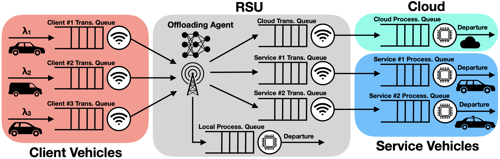
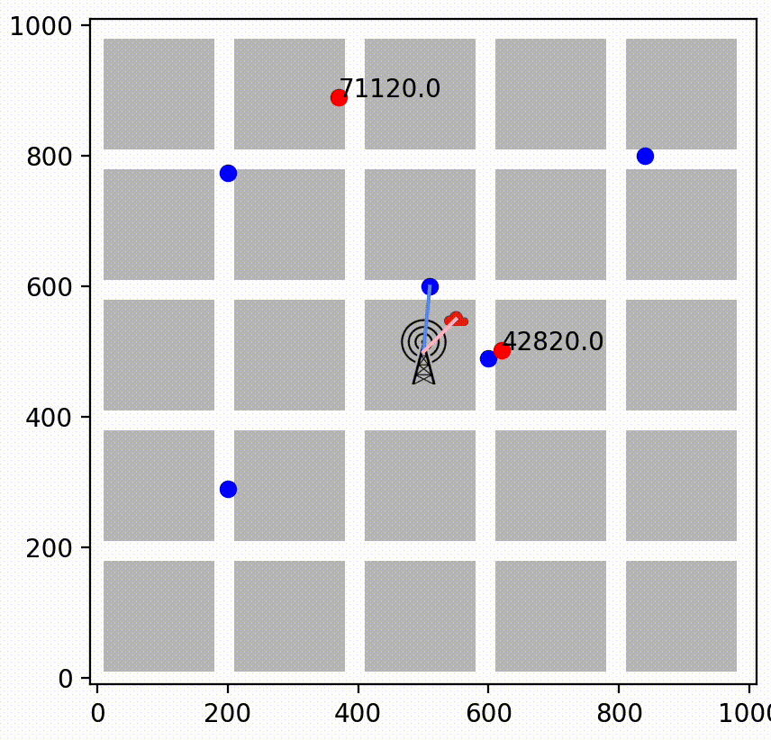

# Vehicular Fog Computing Task Offloading RL Environment

This repository contains the source code of the following paper: <em>"Deep Reinforcement Learning for Delay-Optimized Task Offloading in Vehicular Fog Computing".</em> The pre-print version can be view here: https://arxiv.org/abs/2410.03472. We appreciate citing the paper if you found this repository to be useful.




Paper abstract:
> The imminent rise of autonomous vehicles (AVs) is revolutionizing the future of transport. The Vehicular Fog Computing (VFC) paradigm has emerged to alleviate the load of compute-intensive and delay-sensitive AV programs via task of- floading to nearby vehicles. Effective VFC requires an intelligent and dynamic offloading algorithm. As a result, this paper adapts Deep Reinforcement Learning (DRL) for VFC offloading. First, a simulation environment utilizing realistic hardware and task specifications, in addition to a novel vehicular movement model based on grid-planned cities, is created. Afterward, a DRL-based algorithm is trained and tested on the environment with the goal of minimizing global task delay. The DRL model displays impressive results, outperforming other greedy and conventional methods. The findings further demonstrate the effectiveness of the DRL model in minimizing queue congestion, especially when compared to traditional cloud computing methods that struggle to handle the demands of a large fleet of vehicles. This is corroborated by queuing theory, highlighting the self-scalability of the VFC-based DRL approach.

Here, you can find the custom gymnasium environment used in the paper, as well as the code for training and comparing the RL model with other conventional offloading methods. For more info, feel free to contact us via [ptoopchinezhad@gmail.com].


## Gym Environments
The core of the code focuses on the 3 custom VFC task-offloading gymnasium environments, Each environment corresponds to one of the 3 scenarios considered in the paper:
- Scenario 1: 5 Client Vehicles & 2 Service Vehicles --> `vfcenv.py`
- Scenario 2: 10 Client Vehicles & 4 Service Vehicles --> `vfcenv10.py`
- Scenario 3: 20 Client Vehicles & 8 Service Vehicles --> `vfcenv20.py`
  
Modeling of the central queuing network present in all environments was implemented with help of [Ciw](https://ciw.readthedocs.io/en/latest/). For those interested with creating a new offloading environment, I recommend digging into `custom_components.py`.

## Downloading & Testing
First, install the latest version via git:
```
git clone https://github.com/Procedurally-Generated-Human/VFC-Offloading-RL.git
```
Afterward, install the libraries (preferably in a virtual environment):
```
pip install -r requirements.txt
```
Now, you can test an environment by executing its file, for example:
```
python vfcenv.py
```
Setting `render_mode="human"` will create an animation:



Note: Creating an animation takes up a lot of RAM. For a larger environment, it may run into problems.
